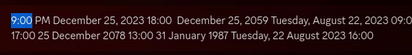

# Datetime Plugin

A fairly simple plugin. Allows the transformation of highlighted text into discord's localized date-time format. Supports multiple date and/or time formats.

Default binding is `ctrl+o` the bound letter is modifiable.

Supports 12 and 24 hour formats, and should support both major forms of dates.

